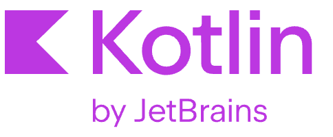
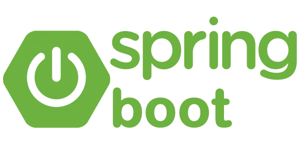

<h1 align="center">Hi there, I'm Micael! 👋</h1>

## About me:

- 🔭 I’m currently deep diving into **Backend Software Engineer** 💻, especially with Java, Spring Boot
- 🌱 Currently learning Kubernetes
- 🤗 Hobbies: Chess ♟️.
<!-- - 📫 How to reach me: micael.lobo@proton.me, and my [LinkedIn](https://linkedin.com/in/micaellobo) -->
 

## ⚙️ My Skills ⚙️

 <a href="#">
    
    
    
    
    
    
    
    
  <a href="#">

  <a href="#">
    <!--  -->
    
  </a>

